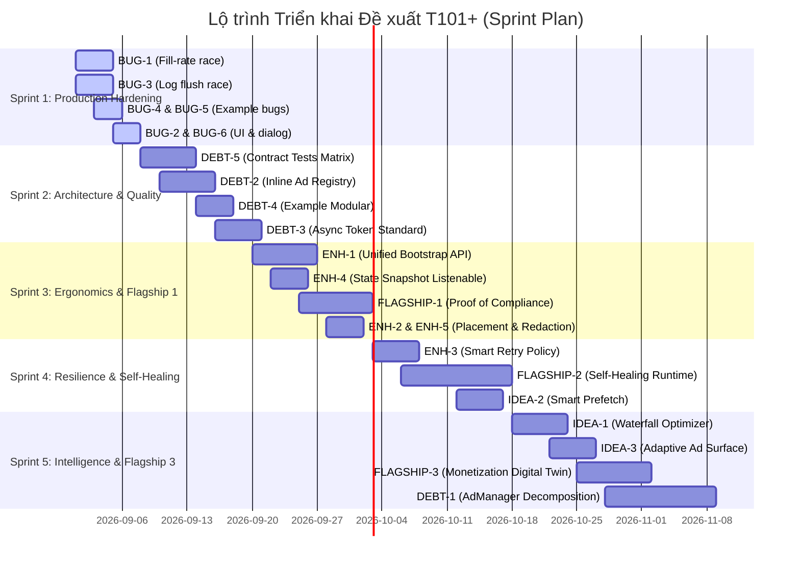

# Đề xuất Lộ trình Phát triển (Roadmap) — `applovin_admob_sdk`

**Tác giả:** Scrum Master + Staff Engineer (Đánh giá Độc lập `agy`)  
**Ngày lập:** 2026-08-31  
**Phiên bản SDK Baseline:** 2.4.1 (sau Audit Round 26 — xem `doc/audit/audit_round26_consolidated.md`)  
**Mục tiêu:** Định hình kế hoạch hoàn thiện và nâng tầm `applovin_admob_sdk` trước khi bước vào giai đoạn production quy mô lớn và mở rộng cộng đồng lập trình viên trên `pub.dev`.

---

## Tuyên ngôn Thiết kế & Nguyên tắc Ràng buộc

1. **Triết lý 100% Không Backend (Serverless / On-Device First):** Mọi tính năng, thuật toán tối ưu, bảo vệ an toàn hay kiểm toán tuân thủ đều phải thực thi hoàn toàn trên thiết bị client. Tuyệt đối không yêu cầu hệ thống server riêng hay thu thập dữ liệu người dùng ra bên ngoài.
2. **Bảo tồn Kiến trúc Nền tảng Đã Audit:** Giữ vững các trụ cột đã qua 26 vòng audit khắt khe (VIP offline Ed25519 cryptographic validation, 12 lớp Safety Layer chống ban tài khoản AdMob/AppLovin, UMP/ATT consent gate song song).
3. **Phân loại Độ ưu tiên & Quy mô Effort (Scrum Standard):**
   - **Ưu tiên:** `P0` (Khẩn cấp / Chặn phát hành), `P1` (Quan trọng cao), `P2` (Trung bình), `P3` (Cải tiến gia tăng).
   - **Effort:** `S` (≤ 2 ngày công), `M` (3–5 ngày công), `L` (1–2 tuần công), `XL` (> 2 tuần công).

---

## 1. BUG CẦN FIX (Lỗi thật trong source hiện tại, chưa có trong Baseline Round 26)

### BUG-1: Race condition mất mát dữ liệu thống kê fill-rate/eCPM trong `FillRateBaselineMonitor`
- **Mô tả vấn đề:** `FillRateBaselineMonitor._onEvent()` xử lý cả `AdLoadEvent` và `AdRevenueEvent` bằng cách gọi `unawaited(_prefs.recordFillRateBaselineSample(...))`. Hàm `recordFillRateBaselineSample` thực hiện cơ chế read-modify-write bất đồng bộ (đọc chuỗi JSON 7 ngày từ SharedPreferences, sửa đổi trong bộ nhớ RAM, rồi ghi lại bằng `setString`). Khi nhiều sự kiện quảng cáo phát sinh đồng thời (ví dụ: màn hình vừa hiển thị banner vừa tải native ad hoặc callback revenue về dồn dập), các luồng ghi cùng đọc một snapshot cũ trước khi kịp lưu xuống đĩa. Phép ghi hoàn tất sau cùng sẽ đè bẹp và làm mất vĩnh viễn các giá trị delta `attempts`, `successes`, `revenueMicros` của các phép ghi trước đó. Hậu quả là baseline 7 ngày của thiết bị bị sai lệch, dẫn đến việc phát tín hiệu cảnh báo suy giảm doanh thu sai (False Alarms trong T97).
- **Khu vực code liên quan:** `lib/src/monetization/fill_rate_baseline_monitor.dart:125, 134`, `lib/src/utils/ad_preferences.dart:410-429`.
- **Độ ưu tiên / Effort:** P1 / M
- **Vì sao đáng làm:** Bảo toàn tính toàn vẹn dữ liệu cho tính năng flagship T97. Nhà phát hành cần dữ liệu đo lường cục bộ chính xác tuyệt đối để đánh giá sức khỏe của mạng quảng cáo.

### BUG-2: `TopToast` timer rò rỉ và dismiss đè lẫn nhau khi kích hoạt liên tiếp
- **Mô tả vấn đề:** `_TopToastWidgetState` kích hoạt `Future.delayed(widget.duration, _animateOut)` mà không giữ tham chiếu `Timer` để hủy khi bị thay thế. Khi gọi `TopToast.show()` lần thứ hai trong khi toast A đang hiển thị, `_current` được cập nhật sang toast B mới. Tuy nhiên, timer của toast A vẫn tiếp tục đếm ngầm; khi hết giờ, hàm `_animateOut()` của A gọi `onDismiss` -> `_dismiss()`, và lệnh này sẽ remove `_current` (chính là toast B). Hậu quả là toast B bị tắt đột ngột trước thời hạn. Ngoài ra, việc người dùng tap trực tiếp vào toast sẽ kích hoạt `_animateOut()` song song với timer, khiến `ctrl.reverse()` và callback dismiss bị gọi hai lần.
- **Khu vực code liên quan:** `lib/src/widget/top_toast.dart:35-62, 108-127`.
- **Độ ưu tiên / Effort:** P2 / S
- **Vì sao đáng làm:** `TopToast` là thành phần UI cốt lõi thông báo trạng thái tải quảng cáo ("Ad not ready", nhắc gia hạn VIP, cảnh báo an toàn). Fix lỗi này giúp giao diện phản hồi mượt mà, không bị nhấp nháy hay mất thông báo bất thường.

### BUG-3: Asynchronous `_eventLog?.flush()` không được await trong `AdManager.destroy()` gây ghi đè dữ liệu giữa các session
- **Mô tả vấn đề:** Trong `AdManager._destroy()`, SDK gọi `unawaited(_eventLog?.flush())` rồi lập tức gán `_eventLog = null`. Khi ứng dụng gọi `destroy()` rồi gọi lại `initialize()` ngay sau đó (chẳng hạn khi chuyển đổi cấu hình, đổi ngôn ngữ, hoặc trong các kịch bản kiểm thử tích hợp), instance `AdEventLog` mới được tạo sẽ đọc dữ liệu từ SharedPreferences trong lúc tác vụ flush bất đồng bộ của session cũ vẫn đang ghi đĩa. Khi tác vụ ghi cũ hoàn tất trễ, nó sẽ ghi đè dữ liệu cũ lên disk, làm mất toàn bộ các sự kiện đầu tiên của session mới và phá hủy tính liên tục của chuỗi nhật ký tuân thủ.
- **Khu vực code liên quan:** `lib/src/core/ad_manager.dart:5081-5082`, `lib/src/compliance/ad_event_log.dart:101-118`, `lib/src/utils/ad_preferences.dart`.
- **Độ ưu tiên / Effort:** P1 / M
- **Vì sao đáng làm:** Đảm bảo tính toàn vẹn của chuỗi nhật ký kiểm toán tuân thủ (Compliance Audit Trail) và tính xác thực của chữ ký số báo cáo (T96) tại ranh giới vòng đời khởi tạo lại SDK.

### BUG-4: Truy cập `_navigated.value` trên `ValueNotifier` đã bị dispose trong `SplashScreen` của `example`
- **Mô tả vấn đề:** Trong `_SplashScreenState` (`example/lib/main.dart`), phương thức `dispose()` thực hiện `_navigated.dispose()`. Nếu một callback tải quảng cáo bất đồng bộ (`loadAppOpenAd` hoặc `AdLoadingDialog.showAdBuffer`) trả về muộn sau khi màn hình splash đã bị đóng/unmount (ví dụ người dùng bấm phím Back nhanh hoặc chuyển ứng dụng), callback kiểm tra `if (!mounted) { _goHome(); return; }`. Trong `_goHome()`, dòng lệnh đầu tiên là `if (_navigated.value) return;`, hành động này truy cập `.value` trên một `ValueNotifier` đã bị dispose và ném ngoại lệ nghiêm trọng: `FlutterError: A ValueNotifier<bool> was used after being disposed.`.
- **Khu vực code liên quan:** `example/lib/main.dart:503-505, 524-546`.
- **Độ ưu tiên / Effort:** P1 / S
- **Vì sao đáng làm:** File `example/lib/main.dart` là mẫu chuẩn được các lập trình viên sao chép trực tiếp vào dự án production. Sửa lỗi này giúp loại bỏ rủi ro crash ứng dụng trong các tình huống chuyển cảnh nhanh.

### BUG-5: `EventBuffer` và `RevenuePanel` bị đứt kết nối stream vĩnh viễn sau khi `AdManager.destroy()`
- **Mô tả vấn đề:** Trong `example/lib/main.dart`, `main()` thực hiện `AdManager().events.listen(EventBuffer.instance.onEvent)` một lần duy nhất lúc khởi động. Tương tự, widget `RevenuePanel` trong `initState` cũng lắng nghe stream này. Khi `AdManager.destroy()` chạy, SDK thực hiện đóng `_eventStream` (`_eventStream.close()`) và tạo controller mới. Khi đó, subscription cũ nhận tín hiệu `done` và bị hủy hoàn toàn, không bao giờ tự kết nối lại với stream mới sau khi SDK khởi tạo lại. Kết quả là toàn bộ màn hình xem sự kiện trực tiếp và panel thống kê doanh thu bị "đóng băng" âm thầm.
- **Khu vực code liên quan:** `example/lib/main.dart:352`, `lib/src/widget/revenue_panel.dart:52`, `lib/src/core/ad_manager.dart:5068`.
- **Độ ưu tiên / Effort:** P2 / S
- **Vì sao đáng làm:** Đảm bảo các công cụ theo dõi, bảng điều khiển doanh thu và nhật ký trực tiếp luôn phản ánh chính xác dữ liệu xuyên suốt các chu kỳ tái khởi tạo hoặc thay đổi cấu hình runtime.

### BUG-6: `AdLoadingDialog` thiếu error boundary bảo vệ chuỗi điều hướng khi context bị unmount
- **Mô tả vấn đề:** Trong `AdLoadingDialog.showAdBuffer`, việc giải phóng dialog phụ thuộc vào việc so khớp thế hệ `myGen == _generation` và lệnh `_removeDialogRoute(navigator, route)`. Tuy nhiên, nếu callback `onComplete()` do phía gọi truyền vào ném ra ngoại lệ chưa bắt (uncaught exception), trạng thái tĩnh `_isShowing` và navigator bị reset nhưng không có cơ chế bắt lỗi an toàn (crash guard) để khôi phục giao diện. Đồng thời, `_AdLoadingDialogContentState.build` phụ thuộc trực tiếp vào `Theme.of(context).brightness` mà không có fallback an toàn khi context bị tách rời khỏi cây widget trong quá trình đóng nhanh.
- **Khu vực code liên quan:** `lib/src/widget/ad_loading_dialog.dart:188-242, 281-296`.
- **Độ ưu tiên / Effort:** P2 / S
- **Vì sao đáng làm:** Dialog đệm là chốt chặn quan trọng trước khi quảng cáo toàn màn hình hiển thị; cần bảo đảm không bao giờ gây treo cây điều hướng hoặc crash giao diện người dùng.

---

## 2. ENHANCEMENT (Cải thiện tính năng hiện có)

### ENH-1: Unified Bootstrap API (`AdSdk.bootstrap`) gom chuỗi ATT + UMP + Init + Fallback Consent
- **Cơ hội cải thiện:** Hiện tại nhà phát triển phải tự xâu chuỗi thủ công theo thứ tự phức tạp: `requestAtt()` -> `requestUmpConsent()` -> fallback `setConsent()` -> `initialize()` -> `loadAppOpenAd()` -> splash timeout. Nếu gọi sai thứ tự, SDK sẽ cảnh báo footgun hoặc lỗi tuân thủ.
- **Giải pháp:** Cung cấp API cấp cao `AdSdk.bootstrap(AdBootstrapConfig)` trả về `AdBootstrapResult` giải quyết toàn bộ quy trình trên chỉ với một hàm gọi duy nhất, đồng thời tự động ghi nhận chẩn đoán và cấu hình tối ưu theo nền tảng (Android/iOS).
- **Khu vực code liên quan:** `lib/src/core/ad_manager.dart`, `lib/src/core/att_consent.dart`, `lib/src/core/ump_consent.dart`, `lib/src/widget/ad_readiness_splash_controller.dart`.
- **Độ ưu tiên / Effort:** P1 / L
- **Giá trị thực tế:** Giảm 70% lượng code mẫu (boilerplate) khi tích hợp SDK lần đầu, loại bỏ hoàn toàn các lỗi tuân thủ do lập trình viên gọi sai thứ tự lifecycle.

### ENH-2: Kiểu dữ liệu placement mạnh (`AdPlacement`) nhất quán cho toàn bộ format và APIs
- **Cơ hội cải thiện:** Một số API đã hỗ trợ `AdPlacement` (như `showInterstitial`), nhưng các widget inline (`BannerAdWidget`, `MrecAdWidget`, `NativeAdWidget`) và các hàm reload/cooldown vẫn chưa nhận placement định danh rõ ràng hoặc mặc định là `.unknown`.
- **Giải pháp:** Mở rộng tham số `AdPlacement` cho tất cả widget và entry points, cung cấp catalog hằng số placement (`AdPlacement.homeBanner`, `AdPlacement.levelEnd`, `AdPlacement.rewardedUnlock`) giúp hệ thống telemetry và safety cap (T92) kiểm soát tần suất chính xác theo từng màn hình.
- **Khu vực code liên quan:** `lib/src/state/ad_placement.dart`, `lib/src/widget/banner_ad_widget.dart`, `lib/src/widget/mrec_ad_widget.dart`, `lib/src/widget/native_ad_widget.dart`, `lib/src/core/ad_manager.dart`.
- **Độ ưu tiên / Effort:** P2 / M
- **Giá trị thực tế:** Hỗ trợ auto-complete chuẩn xác trong IDE, ngăn ngừa lỗi typo chuỗi string và cho phép quản lý tần suất hiển thị chi tiết theo từng khu vực trong ứng dụng.

### ENH-3: Chính sách Retry thông minh phân loại theo loại lỗi và mạng (`AdRetryPolicy`)
- **Cơ hội cải thiện:** Cơ chế backoff hiện tại áp dụng chính sách thời gian chung cho mọi loại lỗi. Tuy nhiên, lỗi `NO_FILL` (hết quảng cáo) cần giãn cách dài hơn, lỗi `NETWORK_ERROR` cần dừng ngay và chờ tín hiệu mạng phục hồi, còn lỗi `INVALID_REQUEST` (sai ID) không nên retry liên tục.
- **Giải pháp:** Bổ sung `AdRetryPolicy` cho phép cấu hình chiến lược retry thông minh theo từng loại lỗi: phân loại lỗi có thể thử lại (retryable), tự động reset cooldown khi có sự kiện kết nối lại internet và hỗ trợ jitter chống thắt cổ chai.
- **Khu vực code liên quan:** `lib/src/state/backoff.dart`, `lib/src/state/ad_slot.dart`, `lib/src/core/ad_manager.dart`, `lib/src/adapters/admob_adapter.dart`, `lib/src/adapters/applovin_adapter.dart`.
- **Độ ưu tiên / Effort:** P2 / M
- **Giá trị thực tế:** Tiết kiệm pin và CPU thiết bị, tránh bị Google/AppLovin phạt do spam request khi hết hàng, đồng thời tải lại quảng cáo nhanh nhất có thể ngay khi mạng trực tuyến trở lại.

### ENH-4: Reactive State Snapshot tổng thể (`AdSdkSnapshotListenable`)
- **Cơ hội cải thiện:** Để cập nhật giao diện (ví dụ làm mờ nút "Xem ad nhận quà" khi ad chưa sẵn sàng hoặc khi người dùng là VIP), app hiện phải lắng nghe nhiều `ValueNotifier` rời rạc (`isInitialised`, `isOfflineListenable`, `canRequestAdsListenable`, `vip.activeListenable`, `isShowingNotifier`).
- **Giải pháp:** Cung cấp `ValueListenable<AdSdkStateSnapshot>` tổng hợp trạng thái bất biến (immutable snapshot) phát ra trạng thái tổng thể: `{isReady, isVip, isOffline, isFullscreenBusy, consentGranted, slots: {appOpen, interstitial, rewarded, ...}}` cập nhật gom cụm (coalesced) theo microtask.
- **Khu vực code liên quan:** `lib/src/core/ad_manager.dart`, `lib/src/state/ad_slot.dart`, `lib/src/widget/debug_ad_overlay.dart`.
- **Độ ưu tiên / Effort:** P2 / M
- **Giá trị thực tế:** Giúp việc gắn kết trạng thái vào UI Flutter trở nên cực kỳ tinh gọn (chỉ cần 1 `ValueListenableBuilder` duy nhất), loại bỏ triệt để nguy cơ rò rỉ listener trong ứng dụng.

### ENH-5: Redaction & Privacy Profiles cho Compliance Report Export
- **Cơ hội cải thiện:** Báo cáo tuân thủ (`exportComplianceReport`) hiện xuất toàn bộ dữ liệu thô bao gồm GAID, IDFA, timestamps, network names, revenue micros. Khi cần chia sẻ cho đối tác hoặc đính kèm báo cáo hỗ trợ, publisher có thể lo ngại lộ dữ liệu nhạy cảm.
- **Giải pháp:** Bổ sung `ComplianceRedactionProfile` với các chế độ: `fullAudit` (mặc định cho kiểm toán), `supportSafe` (ẩn GAID, băm device ID, ẩn doanh thu chi tiết), và `privacyStrict` (loại bỏ toàn bộ timestamp chi tiết).
- **Khu vực code liên quan:** `lib/src/compliance/compliance_report.dart`, `lib/src/compliance/compliance_signing.dart`, `lib/src/monetization/ad_diagnostics.dart`.
- **Độ ưu tiên / Effort:** P2 / S
- **Giá trị thực tế:** Cho phép publisher tự tin gửi báo cáo chẩn đoán sự cố cho bên thứ ba hoặc bộ phận kỹ thuật mà không vi phạm quy định bảo vệ quyền riêng tư người dùng.

### ENH-6: Native Ad Configurable Styling & Shimmer Customizer
- **Cơ hội cải thiện:** `NativeAdWidget` hiện có style shimmer và khung viền mặc định. Khi tích hợp vào các ứng dụng có chủ đề giao diện đặc thù (Dark Mode, Glassmorphism, phong cách thương hiệu), giao diện placeholder tải quảng cáo có thể bị lệch tông.
- **Giải pháp:** Bổ sung tham số `NativeAdStyle` (màu nền, màu hiệu ứng shimmer, border radius bo góc, độ bóng đổ) áp dụng thống nhất cho cả AdMob và AppLovin native container.
- **Khu vực code liên quan:** `lib/src/widget/native_ad_widget.dart`, `lib/src/widget/shimmer_view.dart`.
- **Độ ưu tiên / Effort:** P3 / S
- **Giá trị thực tế:** Nâng cao tính thẩm mỹ và độ tương thích giao diện của Native Ad với thiết kế của ứng dụng, tăng trải nghiệm người dùng và tỷ lệ tương tác tự nhiên.

---

## 3. TECH DEBT (Dọn dẹp, tái cấu trúc, giảm rủi ro bảo trì)

### DEBT-1: Tách `AdManager` monolith (hơn 7.000 dòng) thành các Subsystem Coordinators chuyên biệt
- **Vấn đề nợ kỹ thuật:** `AdManager` hiện là một lớp đơn khối khổng lồ chứa toàn bộ logic từ init, UMP/ATT consent, lifecycle observer, connectivity watch, safety checks, fullscreen mutex, secondary load, event bus cho đến telemetry. Việc duy trì file quá lớn khiến việc audit và sửa lỗi dễ phát sinh side-effect không mong muốn.
- **Kế hoạch refactor:** Tách nội bộ thành các coordinator chuyên trách (`InitCoordinator`, `ConsentCoordinator`, `LifecycleCoordinator`, `FullscreenShowCoordinator`, `AdRetryCoordinator`). `AdManager` đóng vai trò Facade công khai, giữ nguyên 100% public API và thứ tự side-effect để không gây ảnh hưởng đến các ứng dụng đang sử dụng.
- **Khu vực code liên quan:** `lib/src/core/ad_manager.dart`.
- **Độ ưu tiên / Effort:** P1 / XL
- **Giá trị thực tế:** Giảm bán kính ảnh hưởng (blast radius) khi chỉnh sửa code, tăng tốc độ review và đơn giản hóa việc kiểm thử unit test cho từng phân hệ.

### DEBT-2: Trích xuất `InlineAdRegistry` & Controller dùng chung cho Banner, MREC và Native
- **Vấn đề nợ kỹ thuật:** Logic quản lý đa instance (keyed-by-instance), xử lý `RouteAware`, lắng nghe `canRequestAdsListenable`, xử lý thu hồi consent `personalisationRevision`, và post-frame scheduling hiện bị lặp lại gần như nguyên văn ở 3 widget (`BannerAdWidget`, `MrecAdWidget`, `NativeAdWidget`) và cả 2 adapter (`AdMobAdapter`, `AppLovinAdapter`).
- **Kế hoạch refactor:** Xây dựng lớp dùng chung nội bộ `InlineAdLifecycleController<TKey, TAd>` chịu trách nhiệm quản lý vòng đời, map instance và notification state cho mọi định dạng quảng cáo nhúng.
- **Khu vực code liên quan:** `lib/src/widget/banner_ad_widget.dart`, `lib/src/widget/mrec_ad_widget.dart`, `lib/src/widget/native_ad_widget.dart`, `lib/src/adapters/admob_adapter.dart`, `lib/src/adapters/applovin_adapter.dart`, `lib/src/adapters/_inline_visibility.dart`.
- **Độ ưu tiên / Effort:** P2 / L
- **Giá trị thực tế:** Loại bỏ hơn 1.000 dòng mã trùng lặp, đảm bảo bất kỳ cải tiến hoặc bản vá lỗi vòng đời nào cũng được áp dụng đồng nhất cho cả 3 định dạng trên cả 2 mạng quảng cáo.

### DEBT-3: Thống nhất cơ chế hủy và vô hiệu hóa Async Callback (`AsyncCancellationToken`)
- **Vấn đề nợ kỹ thuật:** Mã nguồn hiện tại sử dụng nhiều kỹ thuật phân tán để chặn callback muộn sau khi dispose: kiểm tra `_generation` (trong `AdLoadingDialog`), `_disposed` bool (trong `VipManager`), `_initRevision` (trong `AdManager`), `_consentProviderApplyInFlight`. Sự không đồng nhất này khiến việc chứng minh tính đúng đắn khi audit đòi hỏi phải kiểm tra từng dòng code.
- **Kế hoạch refactor:** Chuẩn hóa abstraction nội bộ `AsyncOperationToken` / `AsyncScope` đại diện cho tính hợp lệ của một tác vụ bất đồng bộ, hỗ trợ tự động hủy (cancel) và kiểm tra hiệu lực tức thì.
- **Khu vực code liên quan:** `lib/src/core/ad_manager.dart`, `lib/src/widget/ad_loading_dialog.dart`, `lib/src/vip/vip_manager.dart`, `lib/src/widget/ad_readiness_splash_controller.dart`.
- **Độ ưu tiên / Effort:** P2 / M
- **Giá trị thực tế:** Tăng tính nhất quán trong kiến trúc phòng chống race condition, giúp mã nguồn trở nên trực quan, dễ bảo trì và dễ viết test giả lập thời gian.

### DEBT-4: Modular hóa `example/lib/main.dart` (2.700 dòng) thành cấu trúc thư mục rõ ràng
- **Vấn đề nợ kỹ thuật:** Toàn bộ 18 màn hình demo, cấu hình, splash screen và ring buffer đều nằm chung trong một file `example/lib/main.dart` dài 2.700 dòng. Cấu trúc đơn khối này gây khó khăn cho việc tra cứu code mẫu và bảo trì integration test.
- **Kế hoạch refactor:** Tách cấu trúc thư mục rõ ràng: `example/lib/demos/` (từng định dạng ad riêng biệt), `example/lib/shared/` (widgets, buffers), `example/lib/config/` mà không làm thay đổi các Widget Key hay text mà test automation đang tìm kiếm.
- **Khu vực code liên quan:** `example/lib/main.dart`, `example/integration_test/*`.
- **Độ ưu tiên / Effort:** P2 / M
- **Giá trị thực tế:** Biến example app thành một bộ tài liệu hướng dẫn mẫu (Cookbook) chuẩn mực, giúp lập trình viên nhanh chóng nắm bắt cách tích hợp từng định dạng cụ thể.

### DEBT-5: Bộ Suite Test hợp đồng chung (`AdProviderAdapterContractTest`) cho cả 2 Adapter
- **Vấn đề nợ kỹ thuật:** Hiện tại test suite của `AdMobAdapter` và `AppLovinAdapter` được viết tách biệt tại nhiều file khác nhau. Một số kịch bản kiểm thử biên (như xử lý đồng thời N instance, timeout watchdog, khôi phục sau khi mất mạng) có thể được test kỹ ở adapter này nhưng bị sót ở adapter kia.
- **Kế hoạch refactor:** Xây dựng một generic contract test runner thực thi cùng một ma trận kiểm thử hành vi nghiêm ngặt trên cả hai adapter: chu kỳ consent, N-instances, watchdog timeout, doanh thu eCPM và cơ chế mutex hiển thị.
- **Khu vực code liên quan:** `lib/src/core/ad_provider_adapter.dart`, `test/admob_*`, `test/applovin_*`, `test/contract/*`.
- **Độ ưu tiên / Effort:** P1 / L
- **Giá trị thực tế:** Khóa chặt tính tương thích đồng đẳng 1:1 giữa AdMob và AppLovin MAX trong CI, ngăn chặn rủi ro lỗi "hoạt động tốt trên AdMob nhưng lỗi trên AppLovin".

---

## 4. Ý TƯỞNG MỚI (Feature không cần backend, on-device only)

### IDEA-1: On-Device Dynamic Waterfall Optimizer (Bộ điều phối ưu tiên mạng quảng cáo trên thiết bị)
- **Cơ hội & Ý tưởng:** Trong mô hình dual-provider, hiệu quả kiếm tiền (fill rate, eCPM, độ trễ phản hồi) của AdMob và AppLovin có thể khác nhau tùy theo quốc gia và định dạng quảng cáo. SDK có thể ghi nhận rolling metrics on-device từ các sự kiện `AdRevenueEvent` và `AdLoadEvent`. Khi host app bật chế độ `autoWaterfall: true`, SDK sẽ tự động ưu tiên gọi load provider có chỉ số eCPM cao hơn và độ trễ thấp hơn trên chính thiết bị đó mà không gửi dữ liệu ra server và không phát sinh shadow request lãng phí.
- **Khu vực code liên quan:** `lib/src/monetization/monetization_arbitrator.dart`, `lib/src/state/ad_event.dart`, `lib/src/core/ad_manager.dart`.
- **Độ ưu tiên / Effort:** P2 / L
- **Giá trị thực tế:** Tối đa hóa doanh thu quảng cáo (ARPU) trên từng thiết bị một cách hoàn toàn tự động mà không cần phụ thuộc vào hệ thống mediation server phức tạp.

### IDEA-2: Contextual Smart Prefetch & Intent-Based Preloading (Nạp trước quảng cáo theo ngữ cảnh)
- **Cơ hội & Ý tưởng:** Hiện tại việc preload quảng cáo chủ yếu dựa vào các mốc cố định (khởi động app, sau khi đóng quảng cáo cũ). SDK có thể cung cấp API `AdManager().notifyUserIntent(AdIntent.approachingBreak)` cho phép ứng dụng báo trước tín hiệu ngữ cảnh (ví dụ: người dùng hoàn thành 80% tiến trình, sắp mở màn hình kết quả). SDK sẽ tính toán cửa sổ thời gian để nạp trước quảng cáo vừa kịp lúc, tránh nạp quá sớm làm hết hạn freshness (sau 1h) hoặc nạp quá muộn khiến người dùng phải chờ loading dialog.
- **Khu vực code liên quan:** `lib/src/core/ad_manager.dart`, `lib/src/state/ad_slot.dart`, `lib/src/core/ad_route_observer.dart`.
- **Độ ưu tiên / Effort:** P2 / M
- **Giá trị thực tế:** Nâng tỷ lệ quảng cáo sẵn sàng hiển thị lên xấp xỉ 100% tại các điểm chạm quan trọng, mang lại trải nghiệm mượt mà không độ trễ cho người dùng mà không tạo request rác.

### IDEA-3: `AdaptiveAdSurface` — Khung hiển thị quảng cáo tự động co giãn đa kích thước
- **Cơ hội & Ý tưởng:** Xây dựng widget `AdaptiveAdSurface` thông minh tự động đo lường không gian hiển thị (thông qua `LayoutBuilder` / `MediaQuery`) và hướng xoay thiết bị (xoay ngang/dọc, máy tính bảng, màn hình gập Foldable) để tự động lựa chọn định dạng tối ưu nhất: Banner chuẩn 320x50 trên điện thoại nhỏ, Leaderboard 728x90 trên tablet, hoặc tự động chuyển sang MREC/Native khi khung chứa mở rộng, kèm hiệu ứng chuyển đổi mượt mà không gây giật layout (layout shift).
- **Khu vực code liên quan:** `lib/src/widget/banner_ad_widget.dart`, `lib/src/widget/mrec_ad_widget.dart`, `lib/src/widget/native_ad_widget.dart`.
- **Độ ưu tiên / Effort:** P2 / M
- **Giá trị thực tế:** Lập trình viên chỉ cần nhúng 1 widget duy nhất vào giao diện là có thể tối ưu hiển thị quảng cáo trên mọi kích thước màn hình từ điện thoại, tablet đến thiết bị màn hình gập.

### IDEA-4: Local Incident Blackbox Recorder & Replay Bundle (Hộp đen ghi nhận sự cố ngoại tuyến)
- **Cơ hội & Ý tưởng:** Khi xảy ra sự cố quảng cáo không hiển thị hoặc bị Store từ chối phê duyệt, việc tái hiện lỗi trên máy của lập trình viên là rất khó khăn. Tính năng này duy trì một ring buffer bộ nhớ cục bộ có giới hạn (lưu trữ hoàn toàn offline) ghi lại dòng thời gian chuyển trạng thái: thay đổi kết nối mạng, chuyển dịch consent, các bước chuyển của state machine và các lần chạm ngưỡng an toàn (safety caps). Host app hoặc tester có thể xuất file "Support Replay Bundle" (được mã hóa/ký số) để gửi cho đội ngũ phát triển replay lại chính xác chuỗi sự kiện.
- **Khu vực code liên quan:** `lib/src/compliance/ad_event_log.dart`, `lib/src/monetization/ad_diagnostics.dart`, `lib/src/compliance/compliance_signing.dart`.
- **Độ ưu tiên / Effort:** P3 / M
- **Giá trị thực tế:** Rút ngắn thời gian chẩn đoán lỗi tích hợp từ nhiều ngày xuống vài phút, đặc biệt hữu ích khi giải quyết các thắc mắc chính sách với đội ngũ duyệt app của Google Play / Apple App Store.

### IDEA-5: Creative Fatigue & Ad Stacking Local Defense (Chống nhàm chán quảng cáo và lặp creative)
- **Cơ hội & Ý tưởng:** Việc một creative quảng cáo lặp đi lặp lại liên tục từ một mạng quảng cáo có thể khiến người dùng khó chịu, dẫn đến hành vi click liên tục để tắt hoặc bỏ ứng dụng. Khi adapter trích xuất được thông tin `networkName` / creative identifier, SDK sẽ theo dõi tần suất phân phối trên thiết bị. Nếu phát hiện một creative xuất hiện quá dày, SDK sẽ áp dụng thời gian nghỉ ngắn (cooldown) hoặc luân chuyển sang network dự phòng, giúp phân bổ quảng cáo đa dạng và tự nhiên hơn.
- **Khu vực code liên quan:** `lib/src/core/ad_safety_config.dart`, `lib/src/state/ad_event.dart`, `lib/src/adapters/admob_adapter.dart`, `lib/src/adapters/applovin_adapter.dart`.
- **Độ ưu tiên / Effort:** P2 / M
- **Giá trị thực tế:** Nâng cao tỷ lệ giữ chân người dùng (retention), giảm thiểu hành vi tương tác tiêu cực và bảo vệ tài khoản quảng cáo trước các thuật toán quét bất thường của Google/AppLovin.

---

## 5. TÍNH NĂNG ĐỘC QUYỀN / FLAGSHIP (Khác biệt hóa cốt lõi của SDK)

> **Câu hỏi chiến lược:** *Tại sao một nhà phát triển hoặc doanh nghiệp nên chọn tích hợp package `applovin_admob_sdk` thay vì tự gọi trực tiếp `google_mobile_ads` và `applovin_max`?*

### FLAGSHIP-1: Proof-of-Compliance Receipt & Audit Engine (Biên lai chứng minh tuân thủ chính sách có chữ ký số mật mã)
- **Điểm khác biệt vượt trội:** Khi tự tích hợp trực tiếp 2 SDK quảng cáo, lập trình viên phải tự chịu trách nhiệm kết nối hàng chục quy định tuân thủ phức tạp (GDPR/UMP consent, ATT trên iOS, COPPA cho trẻ em, giới hạn tần suất chống click fraud, chống hiển thị đè quảng cáo). Một sơ suất nhỏ có thể dẫn đến việc tài khoản AdMob bị khóa vĩnh viễn mà không có bằng chứng đối soát.
- **Kiến trúc thực thi on-device:** Nâng cấp tầng an toàn thành **Cơ chế Kiểm toán Tuân thủ Có thể Chứng minh (Provable Compliance Engine)**: Mọi quyết định hiển thị, chặn quảng cáo, thu hồi consent hoặc áp dụng hạn mức an toàn đều phát sinh một "Compliance Receipt" bất biến. Các biên lai này được liên kết theo chuỗi băm mật mã (Hash-Chained) và ký số Ed25519 cục bộ. Khi có tranh chấp với Google hoặc AppLovin về lưu lượng truy cập bất thường (Invalid Traffic) hoặc vi phạm chính sách consent, nhà phát hành có thể xuất báo cáo có chữ ký số chứng minh bằng toán học rằng ứng dụng đã tuân thủ 100% chính sách tại mọi thời điểm.
- **Khu vực code liên quan:** `lib/src/compliance/compliance_signing.dart`, `lib/src/compliance/compliance_report.dart`, `lib/src/core/ad_safety_config.dart`, `lib/src/consent/consent_manager.dart`.
- **Độ ưu tiên / Effort:** P0 / L
- **Vì sao là Must-Have:** Biến SDK từ một công cụ hiển thị quảng cáo đơn thuần thành một **"Lá chắn Pháp lý & An toàn Tài khoản"** cho doanh nghiệp — giá trị vượt trội hoàn toàn so với việc tự viết wrapper thủ công.

### FLAGSHIP-2: Self-Healing Dual-Provider Failover Runtime (Runtime tự phục hồi và chuyển đổi dự phòng thông minh không cần server)
- **Điểm khác biệt vượt trội:** Thay vì chỉ hỗ trợ chọn cứng một provider tại thời điểm khởi động (`AdConfig.provider`), Flagship này biến SDK thành một **Hệ thống Quảng cáo Tự phục hồi Siêu bền vững (Resilient Ad Engine)**: Bộ máy trạng thái on-device liên tục giám sát chất lượng phản hồi của từng mạng quảng cáo (phát hiện chuỗi lỗi No-Fill liên tiếp, timeout kết nối, hoặc suy giảm tỷ lệ hiển thị bất thường).
- **Kiến trúc thực thi on-device:** Khi phát hiện mạng chính (ví dụ AdMob) gặp sự cố tại một khu vực hoặc bị nghẽn mạng, SDK sẽ tự động kích hoạt Mạch ngắt (Circuit Breaker) và chuyển giao yêu cầu hiển thị sang mạng dự phòng (AppLovin MAX) một cách êm ái tại các ranh giới vòng đời an toàn (không làm gián đoạn quảng cáo đang chiếu), đồng thời định kỳ thăm dò để tự động phục hồi về mạng chính khi điều kiện bình thường trở lại. Toàn bộ hoạt động diễn ra tự động 100% trên máy người dùng, không cần server điều phối.
- **Khu vực code liên quan:** `lib/src/core/ad_manager.dart`, `lib/src/core/ad_provider_adapter.dart`, `lib/src/monetization/fill_rate_baseline_monitor.dart`, `lib/src/state/ad_slot.dart`.
- **Độ ưu tiên / Effort:** P0 / XL
- **Vì sao là Must-Have:** Khắc phục nhược điểm lớn nhất của các ứng dụng di động: mất trắng 100% doanh thu khi một đối tác mạng quảng cáo gặp sự cố. Mang lại sự yên tâm tuyệt đối và đảm bảo dòng tiền liên tục cho nhà phát hành.

### FLAGSHIP-3: On-Device Monetization Digital Twin & Simulator (Bản sao số mô phỏng chính sách quảng cáo trên thiết bị)
- **Điểm khác biệt vượt trội:** Các nhà phát hành thường phải đánh đổi mạo hiểm khi điều chỉnh chính sách quảng cáo: "Nên đặt cooldown interstitial là 30s hay 45s?", "Nên cấp VIP dùng thử 1 ngày hay 3 ngày?", "Thay đổi tần suất có làm sụt giảm eCPM hay tăng nguy cơ vi phạm chính sách không?".
- **Kiến trúc thực thi on-device:** Cung cấp công cụ **Digital Twin On-Device** hoạt động ở chế độ Shadow Mode: Dựa trên lịch sử hành vi thật của người dùng được lưu trong ring buffer cục bộ, SDK thực hiện mô phỏng lại (Deterministic Counterfactual Simulation) các kịch bản cấu hình khác nhau. SDK đưa ra bảng dự báo khoảng tin cậy: Tác động ước tính tới số lượt hiển thị, doanh thu kỳ vọng, tỷ lệ người dùng nâng cấp VIP, và điểm rủi ro tài khoản mà không cần phải đẩy bản cập nhật lên App Store để thử nghiệm rủi ro trên người dùng thật.
- **Khu vực code liên quan:** `lib/src/monetization/monetization_arbitrator.dart`, `lib/src/compliance/ad_event_log.dart`, `lib/src/utils/experiment_bucket.dart`, `lib/src/adaptive/adaptive_frequency.dart`.
- **Độ ưu tiên / Effort:** P1 / L
- **Vì sao là Must-Have:** Đem đến năng lực phân tích dữ liệu và ra quyết định tối ưu hóa doanh thu tương đương các nền tảng AdTech cao cấp mà không tốn chi phí hạ tầng máy chủ và bảo vệ quyền riêng tư tuyệt đối cho người dùng.

---

## 6. Lộ trình Triển khai Đề xuất theo Sprint (Scrum Execution Plan)

### Tiêu chí Hoàn thành Chung (Definition of Done) khi chuyển thành task T101+
1. **Kiểm thử Hồi quy Chặt chẽ:** Mọi bug fix bắt buộc có test case chứng minh lỗi (Red trước fix, Green sau fix); các bài test race condition phải kiểm soát được thứ tự callback bất đồng bộ, không dùng `sleep` thụ động.
2. **Chỉ số Chất lượng Mã nguồn:** `flutter analyze` sạch 100% (0 warning, 0 error), toàn bộ test suite (`flutter test`) vượt qua 100%.
3. **Tương thích Ngược:** Không tạo breaking change trên các public API hiện có trong các bản phát hành minor; các API mới phải có tài liệu và ví dụ mẫu hoạt động được (executable example).
4. **An toàn Bộ nhớ & Lưu trữ:** Dữ liệu lưu trữ cục bộ phải có giới hạn dung lượng (retention cap), phiên bản schema rõ ràng, cơ chế xử lý dữ liệu hỏng (corruption fallback) và API xóa dữ liệu tuân thủ quyền riêng tư.
5. **Không Phát sinh Request Thừa:** Mọi tính năng đo lường, tối ưu hay tự phục hồi đều không được gửi thêm ad request ảo ra ngoài và phải luôn đi qua các lớp kiểm duyệt: Consent, VIP, Safety Cap và Mutex hiển thị.
